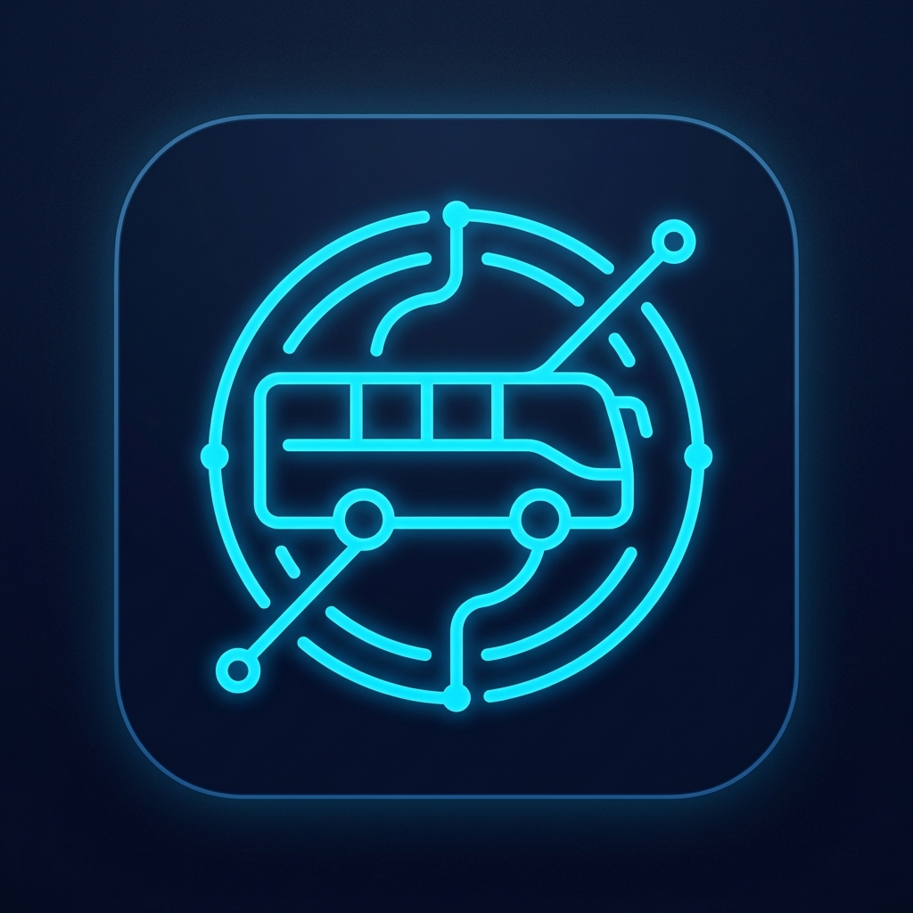
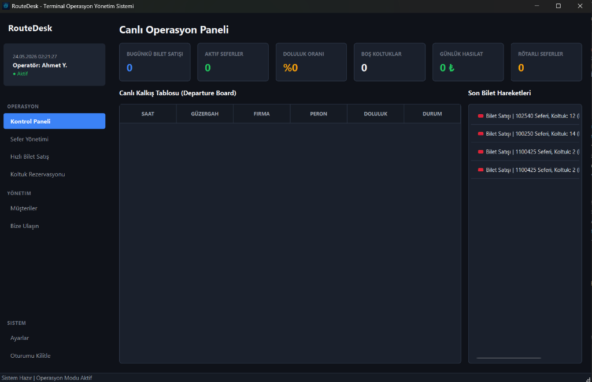
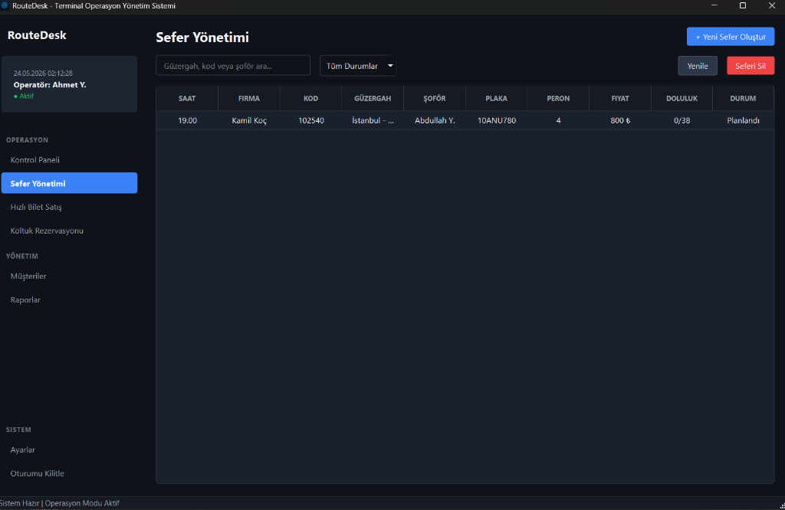
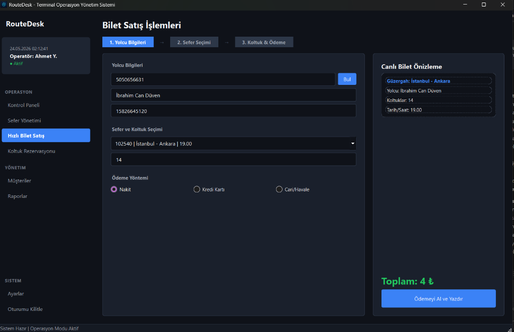

# 🚌 RouteDesk — Terminal Operasyon Yönetim Sistemi

<p align="center">
  
</p>

<p align="center">
  <b>Otobüs terminalleri için modern, masaüstü tabanlı bilet satışı ve operasyon yönetim yazılımı.</b>
</p>

<p align="center">
  
  
  
  
  
</p>

---

## 📌 Proje Hakkında

**RouteDesk**, yerel otobüs terminalleri, ulaşım acenteleri ve VIP taşıma hizmetleri için geliştirilmiş, tamamen **çevrimdışı çalışabilen** masaüstü yönetim uygulamasıdır. Sefer oluşturma, dinamik koltuk planı, bilet satışı ve müşteri kaydından oluşan entegre bir terminal operasyon ekosistemi sunar.

Proje aynı zamanda bir **kurumsal web sitesi** ve **uzaktan yönetim paneli (admin)** içermektedir.

---

## 🗂️ Proje Yapısı

```
RouteDesk/
│
├── src/                        # Masaüstü uygulaması (PyQt6)
│   ├── assets/                 # İkon ve görseller
│   ├── components/             # Sidebar vb. ortak bileşenler
│   ├── database/               # SQLite veritabanı yöneticisi
│   ├── styles/                 # QSS tema dosyaları
│   ├── ui/                     # Tüm ekran modülleri
│   └── main.py                 # Uygulama giriş noktası
│
├── website/                    # Kurumsal web sitesi (Next.js 15)
│   ├── src/
│   │   ├── app/
│   │   │   ├── admin/          # Gizli yönetim paneli (/admin)
│   │   │   ├── api/admin/      # Login/Logout API rotaları
│   │   │   ├── gizlilik/       # Gizlilik Politikası sayfası
│   │   │   ├── hizmet-sartlari/ # Hizmet Şartları sayfası
│   │   │   ├── cerez-politikasi/ # Çerez Politikası sayfası
│   │   │   └── page.tsx        # Ana sayfa
│   │   ├── components/         # Hero, Features, Pricing, Contact vb.
│   │   ├── lib/db.ts           # better-sqlite3 veritabanı bağlayıcısı
│   │   └── middleware.ts       # Admin kimlik doğrulama middleware
│   └── package.json
│
├── screenshots/                # Uygulama ekran görüntüleri
├── docs/                       # Ek belgeler
└── README.md
```

---

## 🖥️ Masaüstü Uygulaması Özellikleri

### 🔐 Kimlik Doğrulama
- Dinamik operatör kayıt ve giriş sistemi (SQLite tabanlı)
- İlk açılışta otomatik kayıt ekranı yönlendirmesi
- Şifreli oturum koruması

### ✈️ Sefer Yönetimi
- Firma, şoför, plaka, peron, güzergah, fiyat ile kapsamlı sefer oluşturma
- Otomatik sefer kodu üretimi
- Durum güncelleme: Planlandı / Yolcu Alımında / Rötarlı / İptal Edildi
- Canlı filtre ve arama

### 🎫 Hızlı Bilet Satışı
- 3 adımlı satış akışı: Yolcu Bilgileri → Sefer Seçimi → Koltuk & Ödeme
- Müşteri telefon numarasıyla otomatik bilgi çekme
- Çoklu ödeme yöntemi (Nakit / Kredi Kartı / Cari/Havale)
- Türkçe "Evet/Hayır" onay diyalogları

### 💺 Dinamik Koltuk Planı
- 2+2 / 2+1 / 3+1 otobüs düzeni desteği
- Gerçek zamanlı dolu/boş koltuk görünümü
- Koltuk üzerine tıklayarak yolcu bilgisi görüntüleme

### 📋 Kontrol Paneli
- Bugünkü bilet satışı, aktif sefer, doluluk oranı istatistikleri
- Canlı Kalkış Tablosu (Departure Board)
- Son bilet hareketleri listesi
- Bilet iptal işlemi

### 👥 Müşteri Yönetimi
- Müşteri kayıt, listeleme ve arama
- Telefon numarası üzerinden otomatik doldurma

### ⚙️ Sistem Ayarları
- Firma adı, terminal adı, yazıcı tercihi yapılandırması
- Veritabanı yedekleme ve geri yükleme (SQLite dosyası)
- CSV veri dışa aktarma

### 🔧 Uzaktan Bakım Modu
- Web admin panelinden tek tuşla bakım modu aktif/pasif
- Bakım modunda masaüstü uygulaması açılmaz, kullanıcıya bilgilendirme mesajı gösterilir

---

## 🌐 Kurumsal Web Sitesi

Proje, masaüstü uygulamasından **tamamen bağımsız** bir Next.js 15 web sitesi içerir.

### Öne Çıkan Bölümler
| Bölüm | Açıklama |
|---|---|
| **Hero** | Uygulamanın misyonu ve CTA |
| **Özellikler** | 6 ana modül tanıtımı |
| **Platform Showcase** | Gerçek uygulama ekran görüntüleri |
| **İş Akışı** | 5 adımlı operasyon süreci |
| **Neden RouteDesk** | Native desktop avantajları |
| **Kullanım Senaryoları** | Sektöre özel kullanım alanları |
| **Fiyatlandırma** | Başlangıç / İşletme / Kurumsal |
| **İletişim** | Formspree AJAX entegrasyonlu demo talebi formu |
| **Yasal Sayfalar** | KVKK, Hizmet Şartları, Çerez Politikası |

### Teknik Özellikler
- **Framework:** Next.js 15 (App Router)
- **Stil:** Tailwind CSS v4
- **İkonlar:** Lucide React
- **Form:** Formspree AJAX (sayfa yönlendirmesiz)
- **Özel scrollbar:** Tasarımla uyumlu webkit scrollbar
- **Favicon:** Uygulamanın kendi `.ico` / `.png` ikonu

---

## 🔒 Admin Yönetim Paneli (`/admin`)

Web sitesinde görünmez, yalnızca yetkili yöneticiler için `/admin` rotasından erişilebilir.

### Özellikler
| Sekme | İşlevler |
|---|---|
| **Sefer Yönetimi** | Tüm seferleri listeleme, durum güncelleme, silme |
| **Bilet İptalleri** | Son biletleri listeleme ve iptal etme |
| **Müşteriler** | Kayıtlı müşterileri listeleme ve silme |
| **Operatörler** | Sistem operatörlerini listeleme ve silme |
| **Sistem Bakım** | Masaüstü uygulamasını uzaktan kilitleme/açma |

### Güvenlik
- Next.js Middleware ile route koruması
- `httpOnly` cookie tabanlı oturum (8 saat)
- `sameSite: strict` CSRF koruması
- Tüm onay işlemleri tasarıma uygun özel Modal ile

### Veritabanı Bağlantısı
Admin paneli, `better-sqlite3` aracılığıyla masaüstü uygulamasının SQLite veritabanına (`routedesk.db`) doğrudan bağlanır. Admin'den yapılan her işlem (sefer silme, bilet iptali, bakım modu) masaüstü uygulamasına anında yansır.

---

## 🚀 Kurulum

### Masaüstü Uygulaması

```bash
# Gereksinimler
pip install PyQt6

# Çalıştırma
python src/main.py
```

### Web Sitesi

```bash
cd website
npm install
npm run dev
# Tarayıcıda: http://localhost:3000
```

### Admin Paneli
```
http://localhost:3000/admin
```

---

## 💻 Teknolojiler

### Masaüstü
| Teknoloji | Kullanım |
|---|---|
| Python 3.10+ | Ana dil |
| PyQt6 | GUI framework |
| SQLite | Yerel veritabanı |
| ctypes (Windows) | AppUserModelID — görev çubuğu ikonu |

### Web Sitesi
| Teknoloji | Kullanım |
|---|---|
| Next.js 15 | React framework (App Router) |
| Tailwind CSS v4 | Stil sistemi |
| Lucide React | İkon seti |
| better-sqlite3 | Admin panel DB bağlantısı |
| Formspree | İletişim formu API |

---

## 📸 Ekran Görüntüleri

| Kontrol Paneli | Sefer Yönetimi | Bilet Satışı |
|---|---|---|
|  |  |  |

---

## 👤 Geliştirici

**İbrahim Can Düven**  
📧 ibrahimcanduven1@gmail.com  
📍 Balıkesir, Türkiye

---

## 📄 Lisans

Bu proje özel kullanım amaçlı geliştirilmiştir. İzinsiz kopyalanamaz, dağıtılamaz.

---

<p align="center">Made with ❤️ for professional transit operations</p>
